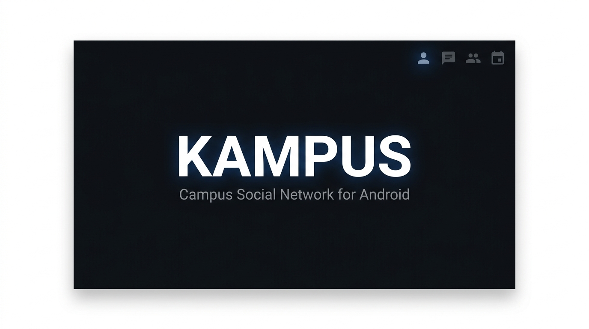

<div align="center">
  

  <br /><br />

  <p>
    <a href="https://github.com/RETH-CHANRITH/KAMPUS/releases"></a>
    <a href="#"></a>
    <a href="#"></a>
    <a href="#"></a>
    <a href="#"></a>
    <a href="./LICENSE"></a>
  </p>

  <p>
    A full-featured campus social networking Android app — built with Kotlin, Jetpack Compose, and Firebase.
  </p>

  <p>
    <a href="#-screenshots">Screenshots</a> ·
    <a href="#-features">Features</a> ·
    <a href="#-architecture">Architecture</a> ·
    <a href="#-getting-started">Getting Started</a> ·
    <a href="#-roadmap">Roadmap</a>
  </p>
</div>

---

## Screenshots

<div align="center">
  <table>
    <tr>
      <td align="center"><b>Groups</b></td>
      <td align="center"><b>Events</b></td>
      <td align="center"><b>Profile</b></td>
    </tr>
    <tr>
      <td></td>
      <td></td>
      <td></td>
    </tr>
  </table>
</div>

---

## Overview

**KAMPUS** is a native Android social networking app built for university students. It brings together everything students need in one place — a social feed, study groups, campus events, real-time chat with voice/video calls, and a friend discovery system.

Built as a Year Three university project using modern Android development standards:

- **100% Jetpack Compose** — no XML layouts
- **Clean Architecture + MVVM** — separation of concerns across 3 layers
- **Firebase** as primary backend — Auth, Firestore, Storage, Messaging
- **Supabase** for media uploads
- **WebRTC** for peer-to-peer voice and video calls

> Package: `com.example.kampus` · Min SDK: 26 (Android 8.0+) · Target SDK: 36

---

## Features

<details>
<summary><b>Authentication</b></summary>

- Email/password sign-up and login
- Google Sign-In via OAuth 2.0
- OTP verification (email or phone)
- Forgot password with secure reset flow
- Persistent session — no re-login on restart

</details>

<details>
<summary><b>Social Feed</b></summary>

- Create posts with text, images, and videos
- Like, comment, and share posts
- Post visibility: public / friends only / private
- Tag people, add location or feeling emoji
- Stories — short-lived media posts with camera or gallery
- Real-time feed updates via Firestore listeners

</details>

<details>
<summary><b>Real-time Chat</b></summary>

- One-on-one direct messages
- Group chat rooms
- Voice calls (WebRTC peer-to-peer)
- Video calls (WebRTC peer-to-peer)
- Message reactions and reply threads
- Seen indicators and online/last-active status
- Call history log

</details>

<details>
<summary><b>Groups</b></summary>

- Browse public groups or request to join private ones
- Create groups with custom name, emoji, cover color, category, and privacy
- My Groups and Discover tabs with live search and filter
- Join request management for private group admins

</details>

<details>
<summary><b>Events</b></summary>

- Campus event feed with cover image, date, and location
- RSVP / mark as interested
- Create events with: type, capacity, speaker, tags, registration deadline, website
- Online and in-person event support
- Paid event and certificate available flags
- Event comments and reactions

</details>

<details>
<summary><b>Profile & Social Graph</b></summary>

- Personal profile: display name, @handle, bio, faculty, year, avatar
- Profile and cover photo upload
- Followers / following system
- Friend request: send, accept, reject, block
- Activity feed showing recent posts, events, and group actions
- Public profile view for any user
- Discover People screen

</details>

<details>
<summary><b>Notifications & Search</b></summary>

- Real-time push notifications via Firebase Cloud Messaging (FCM)
- Deep links from notification tap: open chat, post, or notification list
- Global search across people, posts, groups, and events simultaneously

</details>

<details>
<summary><b>Settings & Appearance</b></summary>

- Edit profile information
- Account settings
- Notification preferences
- Privacy and security controls
- **Appearance**: Dark/Light mode, 7 accent colors, font scale
- Language and region
- Blocked users management
- Help & Support, About

</details>

<details>
<summary><b>Admin Panel</b></summary>

- Admin-only dashboard (role-gated)
- User management
- Reported content review and moderation

</details>

---

## Architecture

KAMPUS follows **Clean Architecture** with the **MVVM** presentation pattern.

```
┌─────────────────────────────────────────────────────────┐
│                    Presentation Layer                    │
│                                                         │
│         Jetpack Compose Screens ←→ ViewModels           │
│              (StateFlow + collectAsState)                │
├─────────────────────────────────────────────────────────┤
│                      Domain Layer                        │
│                                                         │
│      Models · Use Cases · Repository Interfaces         │
│         (pure Kotlin — zero Android dependencies)       │
├─────────────────────────────────────────────────────────┤
│                       Data Layer                         │
│                                                         │
│    Repository Implementations · Remote Data Sources     │
│        Firebase Firestore · Auth · Storage · FCM        │
│                   Supabase Storage                      │
└─────────────────────────────────────────────────────────┘
```

**Rules:**
- The UI layer never talks to the database directly.
- ViewModels call Use Cases. Use Cases call Repository interfaces. Only the Data layer touches Firebase/Supabase.
- The Domain layer has no Android imports — fully unit-testable.

---

## Tech Stack

### Core

| Library | Version | Role |
|---|---|---|
| Kotlin | 2.2.0 | Language |
| Jetpack Compose | BOM 2024.x | UI framework |
| Material Design 3 | — | Design system |
| Navigation Compose | 2.7.7 | Screen routing |
| Kotlin Coroutines | 1.7.3 | Async programming |
| StateFlow / Lifecycle | 2.10.0 | Reactive state |
| Hilt | — | Dependency injection |

### Backend

| Library | Version | Role |
|---|---|---|
| Firebase BoM | 33.12.0 | Version management |
| Firebase Auth | — | Authentication |
| Firebase Firestore | — | Real-time database |
| Firebase Storage | — | File storage |
| Firebase Messaging | — | Push notifications |
| Supabase-kt | 2.2.2 | Media uploads |
| Ktor / OkHttp | 2.3.0 | HTTP and WebSocket client |

### Media & Communication

| Library | Version | Role |
|---|---|---|
| Coil Compose | 2.7.0 | Async image loading |
| UCrop | 2.2.10 | In-app image cropping |
| CameraX | 1.4.1 | Camera capture |
| Media3 / ExoPlayer | 1.3.1 | Video playback |
| WebRTC SDK | 125.6422.07 | Voice and video calls |

### Storage & Security

| Library | Version | Role |
|---|---|---|
| DataStore Preferences | 1.1.7 | Local settings persistence |
| WorkManager | 2.8.1 | Background uploads with retry |
| Security Crypto | 1.1.0-alpha06 | Encrypted local storage |

---

## Project Structure

```
app/src/main/java/com/example/kampus/
│
├── MainActivity.kt
├── KampusApplication.kt
│
├── navigation/
│   ├── NavGraph.kt              # All routes, arguments, and deep links
│   └── Screen.kt                # Route name constants
│
├── domain/                      # Pure Kotlin — no Android imports
│   ├── model/                   # User · Post · Comment · Message · Group · Event · Notification
│   ├── repository/              # 6 repository interfaces
│   └── usecase/                 # Login · Register · CreatePost · SendMessage · JoinGroup · …
│
├── data/
│   ├── remote/                  # FirebaseDataSource · FirebaseAuthSource · SupabaseDataSource
│   └── repository/              # 6 repository implementations
│
├── di/                          # Hilt modules: App · Firebase · Supabase · Repository
│
├── ui/
│   ├── theme/                   # Color · Type · Theme · ThemeController · AppSettingsStore
│   ├── components/              # Shared composables: Button · Avatar · InputField · Dialog
│   ├── splash/
│   ├── onboarding/
│   ├── auth/                    # Login · Register · OTP · ForgotPassword · ResetPassword
│   ├── feed/                    # FeedScreen · FeedViewModel · CreatePost · PostItem · Stories
│   ├── post/                    # PostDetail · PostViewModel · CommentItem
│   ├── chat/                    # ChatList · ChatScreen · ChatViewModel · CallScreen · MessageBubble
│   ├── groups/                  # GroupList · GroupDetail · CreateGroup · GroupViewModel
│   ├── events/                  # EventList · EventDetail · CreateEvent · EventViewModel
│   ├── profile/                 # Profile · EditProfile · Friends · FriendRequests · Settings (9 screens)
│   ├── notifications/
│   ├── search/
│   ├── story/
│   ├── admin/                   # Dashboard · ManageUsers · ReportedContent
│   └── localization/            # UiStrings — multi-language string table
│
├── viewmodel/                   # Shared ViewModels (e.g. GroupsViewModel)
└── utils/                       # Constants · Resource · DateUtils · ImageUtils · ActivityLogger
```

---

## Data Models

```kotlin
// User
data class User(
    val id: String, val displayName: String, val handle: String,
    val bio: String, val faculty: String, val year: String,
    val profileImageUrl: String, val coverImageUrl: String,
    val isVerified: Boolean, val isOnline: Boolean,
    val stats: UserStats  // posts, followers, following
)

// Event
data class Event(
    val id: String?, val title: String, val description: String?,
    val location: String?, val imageUrl: String?, val ownerId: String,
    val startDate: Long?, val endDate: Long?, val capacity: Int?,
    val eventType: String?, val onlineEvent: Boolean,
    val paidEvent: Boolean, val certificateAvailable: Boolean,
    val speaker: String?, val tags: List<String>?
)

// Group
data class GroupData(
    val id: Int, val name: String, val category: String,
    val coverColor1: Color, val coverColor2: Color,
    val coverEmoji: String, val description: String,
    val members: Int, val posts: Int, val privacy: String
)
```

| Model | Key Fields |
|---|---|
| `Comment` | id · postId · authorId · text · timestamp |
| `Message` | id · chatId · senderId · text · mediaUrl · type |
| `Notification` | id · type · actorId · targetId · isRead |
| `FriendRequest` | fromUserId · toUserId · status (PENDING / ACCEPTED / REJECTED / BLOCKED) |

---

## Navigation

All routes defined in `NavGraph.kt`. Route strings declared in the `Routes` object.

```
Splash
├── First launch  →  Onboarding  →  Login / Register
└── Returning     →  Home
                       ├── Post Detail  /  Create Post
                       ├── Notifications
                       ├── Search
                       ├── Groups
                       │     ├── Group Detail
                       │     └── Create Group
                       ├── Events
                       │     ├── Event Detail
                       │     └── Create Event
                       ├── Chat
                       │     └── Chat Screen → Call Screen
                       └── Profile
                             ├── Edit Profile
                             ├── Friends / Friend Requests / Discover People
                             ├── Public Profile (userId)
                             └── Settings → Account / Notifications /
                                           Privacy / Appearance /
                                           Language / Blocked / Help / About
```

**Supported deep links:**
```
kampus://profile/{userId}
https://kampus.app/profile/{userId}
```

---

## Theme System

`ThemeController` is a global Compose-observable singleton that drives the full app appearance at runtime — no restart required.

```kotlin
object ThemeController {
    var isDark     : Boolean    // dark or light mode
    var fontScale  : Float      // 0.85 · 1.0 · 1.15 · 1.3
    var accent     : AppAccent  // chosen color
}
```

| Accent | Hex |
|---|---|
| Blue (default) | `#0D7FFF` |
| Purple | `#9C27B0` |
| Pink | `#E91E63` |
| Red | `#F44336` |
| Orange | `#FF9800` |
| Green | `#4CAF50` |
| Teal | `#009688` |

Settings are persisted via `AppSettingsStore` (DataStore Preferences).

---

## Security

| Area | Implementation |
|---|---|
| Firestore rules | Server-side security rules per collection (`firestore.rules`) |
| E2EE chat | End-to-end encryption architecture — see [`E2EE_ARCHITECTURE.md`](./E2EE_ARCHITECTURE.md) |
| Local storage | `EncryptedSharedPreferences` via Security Crypto |
| Admin gating | Admin role verified server-side before rendering admin screens |
| FCM tokens | Updated per session, removed on logout |

---

## Getting Started

### Requirements

- [Android Studio](https://developer.android.com/studio) Hedgehog or later
- JDK 11+
- Firebase project with **Authentication**, **Firestore**, **Storage**, and **Cloud Messaging** enabled
- `google-services.json` — download from [Firebase Console](https://console.firebase.google.com) → place in `app/`
- Supabase project — add your URL and anon key in `di/SupabaseModule.kt`

### Clone and Run

```bash
git clone https://github.com/RETH-CHANRITH/KAMPUS.git
cd KAMPUS
```

Open in Android Studio, let Gradle sync, place `google-services.json` in `app/`, then press **Run**.

---

## Build

```bash
# Debug build
./gradlew assembleDebug

# Release build
./gradlew assembleRelease

# Run tests
./gradlew test
```

| Config | Value |
|---|---|
| `applicationId` | `com.example.kampus` |
| `minSdk` | `26` — Android 8.0+ |
| `targetSdk` | `36` — Android 16 |
| `versionName` | `1.0` |
| `jvmTarget` | `11` |

---

## Roadmap

**Completed**
- [x] Email/Password, Google Sign-In, OTP authentication
- [x] Social feed — posts, likes, comments, share, stories
- [x] Real-time direct messaging and group chat
- [x] Voice and video calls (WebRTC)
- [x] Groups — public and private, join requests
- [x] Events — RSVP, create, detailed info
- [x] User profiles, followers/following, friend system
- [x] Push notifications with FCM deep links
- [x] Global search
- [x] Dark/Light theme, 7 accents, font scale
- [x] Admin dashboard and content moderation
- [x] Multi-language localization

**Planned**
- [ ] Story reactions
- [ ] Scheduled events with calendar integration
- [ ] Live streaming
- [ ] Student marketplace

---

## Contributing

1. Fork the repository
2. Create a feature branch: `git checkout -b feature/your-feature`
3. Commit using [Conventional Commits](https://www.conventionalcommits.org):
   ```
   feat: add new feature
   fix: resolve a bug
   docs: update documentation
   refactor: restructure without behavior change
   ```
4. Push and open a Pull Request against `main`

For major changes, open an issue first to discuss the approach.

---

## License

This project is licensed under the **MIT License** — see [LICENSE](./LICENSE) for details.

---

<div align="center">
  <sub>KAMPUS · Year Three University Project · <a href="https://github.com/RETH-CHANRITH/KAMPUS">RETH-CHANRITH/KAMPUS</a></sub>
</div>
